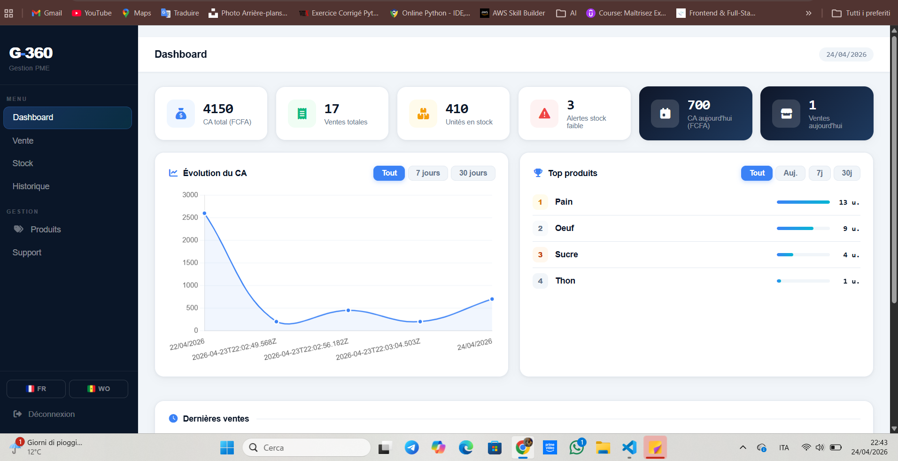

# Application de gestion commerciale

Une application web simple permettant de gérer les produits, les ventes, le stock et les statistiques.

## Fonctionnalités

- Authentification utilisateur (basée sur localStorage)
- Gestion des produits (ajout / suppression)
- Enregistrement des ventes
- Tableau de bord :
- Chiffre d’affaires total
- CA par jour
- Produits les plus vendus
- Filtrage de l’historique (Aujourd’hui / Tout)
- Graphiques de performance
- Export des ventes en CSV
- Réinitialisation du stock
- Mise à jour du stock en temps réel

## Technologies

- HTML5
- CSS3
- JavaScript (Vanilla)

## Aperçu

## Objectif

Ce projet a été réalisé pour :

- Implémenter une logique métier
- Manipuler le DOM
- Gérer les données côté client
- Construire une application complète en frontend

## Limites

- Pas de backend (localStorage uniquement)
- Authentification non sécurisée
- Utilisation sur un seul appareil

## Améliorations possibles

- Intégration d’un backend (Django / Node.js)
- Authentification sécurisée
- Base de données
- Synchronisation multi-utilisateurs
- Déploiement en ligne